# readme

2022.12.4 update
作者已经忘记大部分内容了，而且最近有乱七八糟的事情忙住了，可能不太能回去回顾这个项目。
不过可以提供点调试的建议：

1. 用xchg bx,bx 多调试，C语言中也可以用__asm__()执行xchg bx,bx进行调试的，大多数时候调试就能帮你定位到问题
2. 有时候遇到一些偶尔出现，不太能复现的问题，他可能真的是原orange‘OS 本来就不稳定导致的，大多数时候还是只能选择避开，解决比较困难。
3. 老师们人都挺好的，验收不用紧张，加油！

**如果有同学想要贡献请直接提pr,我会定期上github查看确认，并在readme中致谢**

-------

此markdown文档用于解释本次os作业中的文件的作用和使用方法.

### 运行环境

本次实验的运行环境如下, 若出现运行异常可能是环境问题导致, 但是使用已经写好的img文件应该不会存在问题.

- Oracle Virtual Box 6.1.18

- bochs 2.7.0

- Ubuntu 14.04(32-bit)

- gcc version 4.8.4 (Ubuntu 4.8.4-2ubuntu1~14.04.4) 

### 文件目录

- queueAndPage文件夹中为只实现了多级反馈队列调度和页分配部分(PARTA TASK1).的项目文件
- otherTasks文件夹中为实现了其他任务(PARTA TASK2, TASK3, PARTB TASK1 ,TASK2, TASK3)的项目文件
- 2019302180149-武若叶-操作系统大作业实验报告为总的实验报告

### 编译方法

若不涉及command中的修改, 则直接再文件夹中make image即可编译, 若涉及command中的修改则需要先make image, 在进入command中make , make install , 最后再出来make , 已经写在了123.sh中,  使用bash 123.sh即可进行编译.

### 检验流程

注意, 本次作业中, 切换tty的按键为左shift + Fn

#### PARTA TASK1

在文件夹queueAndPage中

直接bochs运行即可, 会进入断点, 可以info tab查看映射关系

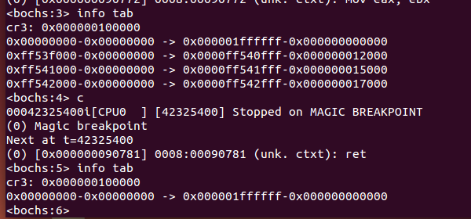

输入命令c , 继续运行后可以看到页面上输出了pid ,不要让他输出太久, 否则会报错(为了打印,写到不可写的地址了)

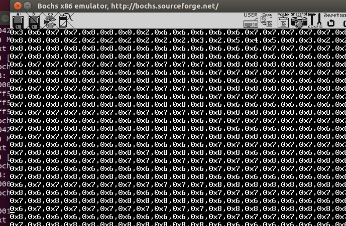

若不想输出pid, 则在kernel/clock.c中的clock_handler中的 51, 52行注释掉. 重新make image编译后即可运行

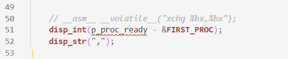

#### PART A TASK2,3

后面的任务都在文件夹otherTasks中

为防止编译等环境问题, 已经将内容写入到80m.img3中, 使用时, 复制一份为80m.img(cp 80m.img3 80m.img , 当然也可以自己编译 bash 123.sh)

直接bochs运行即可

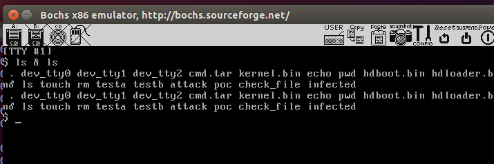

**注: 此处可能在执行touch时报错**,

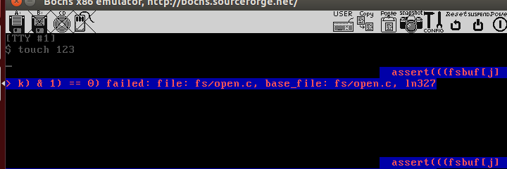

但是在先rm一个文件以后再touch则不会出错, 猜测是文件系统中存在一定问题,  因某些原因达到了文件数的上限. 猜测是原生os问题, 故没有深究.

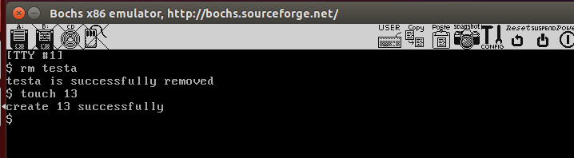

#### PARTB  TASK1

直接执行poc即可测试栈溢出, 中间设置多个断点用于查看栈结构

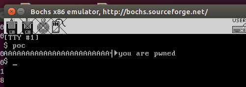

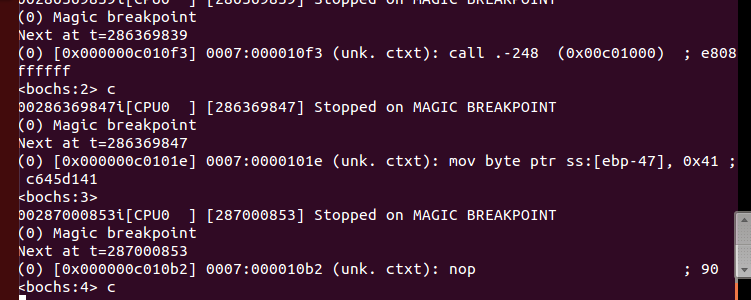

直接执行attack即可覆盖其他可执行程序 ,然后执行任何程序都会打印然后回到shell

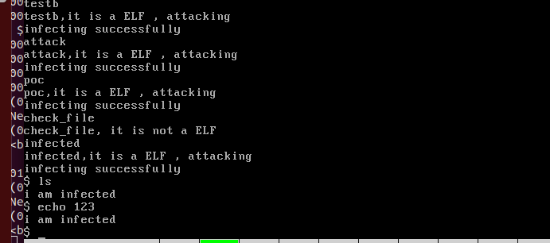

#### PARTB  TASK2

若之前执行过attack, 则此时需要重装所有的可执行文件, 所以需要重新编译,(bash 123.sh) 或 直接使用我已经编译好的img文件80m.img4

静态可信的开关在include/sys/global.h中 第66行,

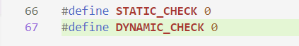

将其置1即为打开, 因为静态可信需要让untar执行一次, 所以也需要整个重新编译或直接使用我已经编译好的img文件80m.img4

在正常执行程序时会打印check right

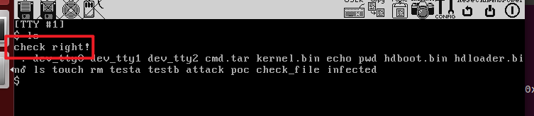

若程序不是之前就有的, 会打印程序未注册

若程序被修改, 则会检测出修改, 并且显示程序被修改, 并且阻止运行

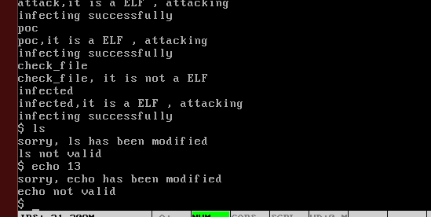

#### PARTB TASK3

动态可信的开关在include/sys/global.h中 第67行,

将其置1即为打开, 需要make image 编译或直接使用我写好的80m.img5

直接执行poc即可

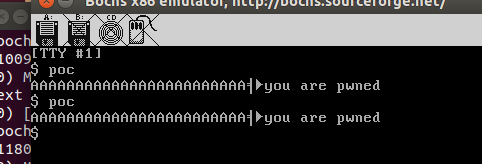

 在终端能看到相应的输出, 若没有输出, 可能是打印的内容没有显示在屏幕中, 可以再执行一次

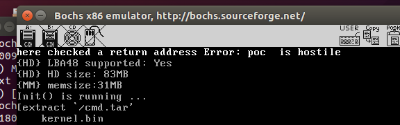

更多详情请看实验报告
